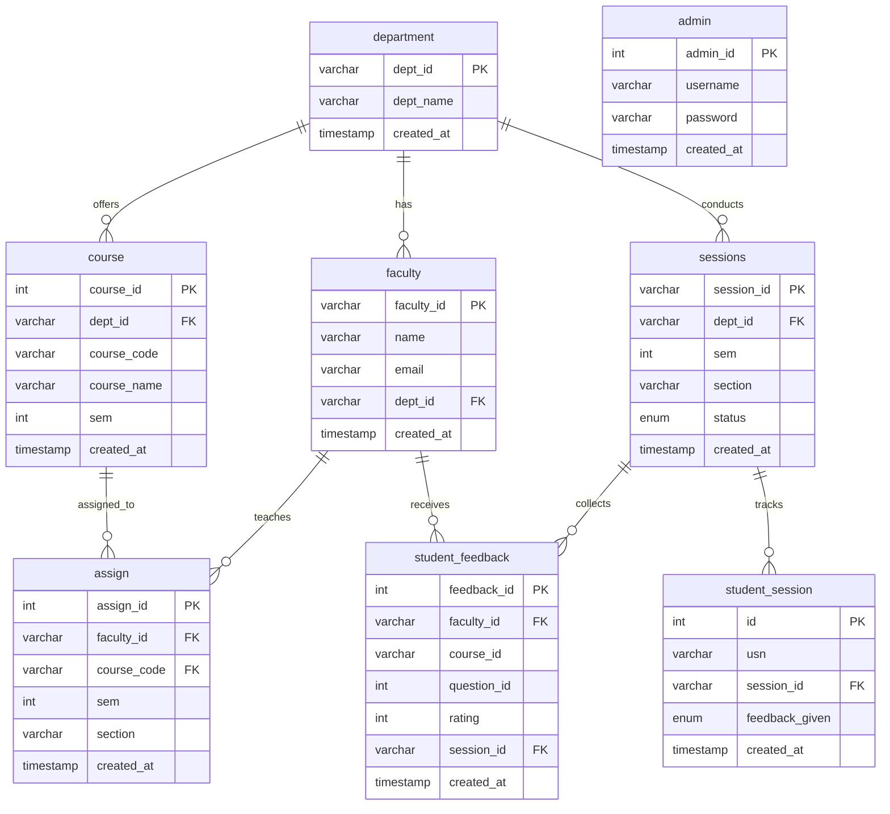

# College Feedback System - Database Information

## Database Overview

**Database Name**: `college_feedback_system`

This database supports a college feedback management system where students can provide anonymous feedback for faculty members teaching various courses.

---

## Database Structure

### Tables

1. **admin** - Admin user credentials
2. **department** - Academic departments
3. **faculty** - Faculty members
4. **course** - Courses offered by departments
5. **sessions** - Feedback collection sessions
6. **assign** - Faculty-to-course assignments
7. **student_session** - Student participation tracking
8. **student_feedback** - Anonymous feedback responses

---

## Entity Relationship Diagram



---

## Sample Data Included

The schema file includes sample data:

- **Admin**: username: `admin`, password: `admin`
- **4 Departments**: CSE, ECE, ME, CE
- **3 Faculty members**
- **5 Courses**
- **1 Active session**
- **3 Course assignments**

---

## How to Import the Database

### Once MySQL is installed and running:

#### Option 1: Using MySQL Command Line
```bash
mysql -u root -p < database_schema.sql
```

#### Option 2: Using MySQL Workbench
1. Open MySQL Workbench
2. Connect to your local MySQL server
3. Go to File → Run SQL Script
4. Select `database_schema.sql`
5. Click Run

#### Option 3: Using Terminal
```bash
# Login to MySQL
mysql -u root -p

# Run the schema file
source /Users/nivedanps/Desktop/project/database_schema.sql
```

---

## Database Configuration

The backend is configured to connect with:
- **Host**: localhost
- **User**: root
- **Password**: (empty)
- **Database**: college_feedback_system
- **Port**: 3306

---

## Next Steps

1. **Install MySQL** (if not already installed)
2. **Start MySQL service**
3. **Import the schema** using one of the methods above
4. **Restart the backend** (it will auto-connect)
5. **Access the application** at http://localhost:5173/

---

## Feedback Questions

The system uses 5 questions for rating faculty (ratings 1-5):
1. Question 1
2. Question 2
3. Question 3
4. Question 4
5. Question 5

*(You may want to customize these questions in your frontend)*
